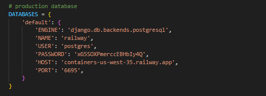

## Giới thiệu

Backend server cho quản lý khách sạn. Sử dụng Django, Django_rest_api.

## Yêu cầu phần mềm:

- Hệ điều hành Window
- Python version >  3.7

## Cài đặt

clone link repo này về và thực hiện theo các bước
https://github.com/Duongmanhvp/SE_HotelManagement.git

1. Thiết lập virtual environment (optional)
 
    tạo virtual environment ở thư mục chứa project
    ```
    python -m venv /path/to/new/virtual/environment
    ```

    khởi động venv cho các lần chạy sau

    cmd:

    ```
    C:\> <venv>\Scripts\activate.bat
    ```

    window powershell:
    ```
    PS C:\> <venv>\Scripts\Activate.ps1
    ```

2. Tải các package cần thiết

    trong cmd, chạy:
    ```
    C:\> pip install -r requirements.txt
    ```

3. Liên kết cơ sở dữ liệu với backend

    trong file hotel_management/setting.py, thay đổi

    

    sang cở sở dữ liệu tùy chọn. Django chính thức hỗ trợ các cơ sở dữ liệu:

    - PostgreSQL
    - MariaDB
    - MySQL
    - Oracle
    - SQLite

4. ORM và cài đặt dữ liệu

    sau khi liên kết được cơ sở dữ liệu, sử dụng Django ORM để tạo schema trên cơ sở dữ liệu
    ```
    C:\> python manage.py makemigrations
    C:\> python manage.py migrates
    ```

    sau đó có thể thêm dữ liệu trên cơ sở dữ liệu

5. Chạy backend server

    lệnh chạy backend server

    ```
    C:\> python manage.py runserver
    ```

    vào đường dẫn http://127.0.0.1:8000 để tới API
